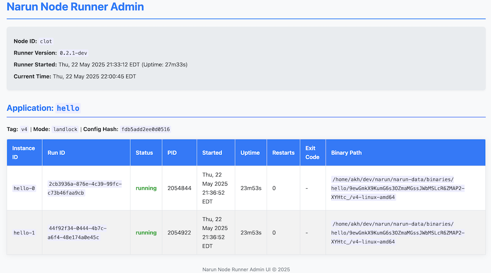

# Narun: A NATS-Based Microservice Toolkit

A simple ecosystem to deploy, maintain and expose services.

It is built around an API gateway exposing backend HTTP/gRPC services (consumers) using the [NATS Micro](https://docs.nats.io/reference/nats-protocols/micro) protocol and a node runner to watch the services lifecycle.

It aims for simplicity and lightness targeting edge devices.


## Status

WORK IN PROGRESS, do not use in production unless you want to suffer.

## Concepts & Decisions

Kubernetes is great for managing containerized applications at scale, but it can be complex and resource-intensive.
Narun aims to provide a simpler and more lightweight alternative for edge devices.
It relies on NATS clusters for any stateful needs: Object Storage, Database, Cache, Queues.
So no need for stateful services, anything else is stateless and ephemeral.
Modern developments ecosystem, Rust, Go, Zig or Deno, do not require full containerized operating systems, static binaries are good enough in many situations.
No need to ship containers so no need for a full fledge registry.
NATS pub/sub mechanism, solves service discovery and load balancing, so no need for a regular API Gateway.
No support for multi tenancy.
Mandatory support Linux on amd64, arm64, and RISC-V, this is removing some options like firecracker.


## Components

### 1. `narun-gw` (Gateway)

*   **Function:** A standalone HTTP and gRPC gateway.
*   **Mechanism:** Listens for incoming HTTP/gRPC requests. Based on its configuration (`config.yaml`), it maps the request (HTTP path/method or gRPC service name) to a target NATS Micro service name. It then sends a NATS request message (containing the body and propagated headers/metadata) to the subject corresponding to that service name. It waits for a NATS reply and forwards it back to the original client.
*   **Configuration:** See `cmd/narun-gw/config.yaml` for an example.
*   **Running:** `go run ./cmd/narun-gw -config ./config.yaml`

### 2. `caddynarun` (Caddy Plugin)

*   **Function:** Same as `narun-gw` but embedded within Caddy.
*   **Mechanism:** Integrates with Caddy's request pipeline. Uses directives in the `Caddyfile` to map specific HTTP routes (path/method) to NATS Micro service names. It forwards matching requests as NATS request messages (similar to `narun-gw`) and returns the NATS reply.
*   **Configuration:** Via the `narun` directive within a Caddyfile route block. See `caddynarun/README.md` for details and examples.
*   **Running:** Requires building a custom Caddy binary including the plugin:
    ```bash
    xcaddy build --with github.com/akhenakh/narun/caddynarun@latest
    ./caddy run --config /path/to/your/Caddyfile
    ```
*   The Caddy plugin has the same functionnalities as `narun-gw`, (except it does not support gRPC yet).
    You probably want to use the `caddynarun` plugin instead if your gateway is exposing service publically.

### 3. `node-runner`

*   **Function:** A simple agent that runs on each node designated to execute application processes.
    This is NOT a scheduler, like Kubernetes, but rather a lightweight services runner, targeting edge devices.
    The gateways can run without the node-runner, since the application are self registering, node-runner is ensuring the lifecycle of the applications.

*   **Mechanism:**
    *   Connects to NATS and obtains a unique Node ID.
    *   Registers itself and sends periodic heartbeats using a NATS Key-Value store (`node-runner-states`).
    *   Watches another NATS Key-Value store (`app-configs`) for application specifications (`ServiceSpec`).
    *   When a spec targets the runner's node ID, it fetches the required binary from a NATS Object Store (`app-binaries`).
    *   Starts, monitors, and restarts the application process based on the spec.
    *   Forwards application stdout/stderr to NATS subjects (e.g., `logs.<app-name>.<node-id>`).
    *   Publishes application instance status updates to NATS subjects (e.g., `status.<app-name>.<node-id>`).
    *   The node runner expose a web UI on port 9101, showing running applications.
*   **Configuration:** Primarily via command-line flags: `-nats-url`, `-node-id`, `-data-dir`.
*   **Running:** `go run ./cmd/node-runner -nats-url <NATS_URL> -node-id <NODE_ID> -data-dir /var/lib/node-runner` (on each target node).



### 4. `narun` (Management CLI)

*   **Function:** This tool provides commands to manage Narun application deployments, view logs, and inspect the state of binaries and running applications.
*   **Available Commands:**
    *   `deploy`: Upload application binaries and configuration.
    *   `logs`: Stream logs from node runners.
    *   `list-images`: List application binaries stored in NATS Object Store.
    *   `list-apps`: List deployed applications and their status on nodes.
    *   `delete-app`:  Delete an application configuration from NATS KV.
    *   `narun secret`: Manage secrets for applications.
    *   `narun files`: Manage files for applications.
    *   `help`: Show detailed help.

## Example Workflow

1.  **Start NATS:** Ensure a NATS server (with JetStream enabled for `node-runner`) is running.
2.  **Start `node-runner`:** Run the `node-runner` agent on one or more target nodes.
    ```bash
    # mock two nodes
    ./node-runner -nats-url <NATS_URL> -node-id node-1 -data-dir /data/narun1 &
    ./node-runner -nats-url <NATS_URL> -node-id node-2 -data-dir /data/narun2 &
    ```
3.  **Prepare Application:**
    *   Build your backend application binary (e.g., `./hello-consumer`).
    *   Create its `ServiceSpec` YAML (e.g., `hello.yaml`), specifying the `binary_object` name and targeting nodes (e.g., `node-1`).
4.  **Deploy Application:** Use `narun-deploy` to upload the binary and spec.
    ```bash
    ./narun deploy -config hello.yaml -binary ./hello-consumer
    ```
    *   `node-runner` on `node-1` will detect the config, download the binary, and start the `hello-consumer` process. The consumer will register itself as a NATS Micro service (e.g., named "hello").
5.  **Start Gateway:** Run `narun-gw` configured to route `/hello/` requests to the NATS Micro service named "hello".
    ```bash
    ./narun-gw -config gateway-config.yaml &
    ```
6.  **Send Request:** Send an HTTP request to the gateway.
    ```bash
    curl -X POST -d '{"name":"NATS User"}' http://gateway-address:8080/hello/
    ```
7.  **Flow:** Gateway -> NATS Request (to subject "hello") -> `hello-consumer` (listening on "hello") -> NATS Reply -> Gateway -> Client Response.

## Building

```bash
# Build Gateway
go build -o narun-gw ./cmd/narun-gw

# Build Node Runner
go build -o node-runner ./cmd/node-runner

# Build Deployment Tool
go build -o narun ./cmd/narun

# Build Example HTTP Consumer
go build -o hello-consumer ./consumers/cmd/hello

# Build Example gRPC Consumer (requires protoc setup)
# cd consumers/cmd/grpc-hello && make proto && cd ../../..
# go build -o grpc-hello-consumer ./consumers/cmd/grpc-hello

# Build Caddy with Plugin
# Assumes xcaddy is installed (go install github.com/caddyserver/xcaddy/cmd/xcaddy@latest)
xcaddy build --with github.com/akhenakh/narun/caddynarun@latest

## Why NATS Micro (and narun)?

Traditional microservice architectures often rely on direct HTTP/gRPC calls between services, requiring service discovery, client-side or network load balancing, and tightly coupled network visibility. NATS Micro offers an alternative approach with several advantages:

*   **Decoupling:** Services communicate via named NATS subjects, not direct IP addresses or ports. The gateway only needs to know the target NATS service name.
*   **Location Transparency:** Backend services can run anywhere the NATS infrastructure reaches, without the gateway needing to know their specific location.
*   **Scalability & Resilience:** NATS handles service discovery and load balances requests across multiple instances of a backend service automatically. If a service instance fails, NATS routes requests to healthy ones.
*   **Simplified Backend:** Developers can focus on business logic using standard Go interfaces, while `nconsumer` handles the NATS communication details.

`narun-gw` acts as the entry point, translating familiar HTTP/gRPC requests into NATS Micro requests, enabling easy integration with existing tools and clients.

To fully understand NATS Service capabilities, you can watch [this introduction video](https://www.youtube.com/watch?v=AiUazlrtgyU).


## Key Features

*   **HTTP & gRPC Gateway:** Bridges both HTTP and gRPC requests to NATS Micro services.
*   **Standard Interfaces:** Backend services use standard Go `http.Handler` or generated gRPC service interfaces.
*   **Configuration Driven:** Simple YAML file maps HTTP paths/methods or gRPC services to NATS Micro service names.
*   **NATS Micro Integration:** Leverages built-in NATS service discovery, load balancing, and observability.
*   **Observability:** Exposes Prometheus metrics for gateway requests and NATS interactions.
*   **Graceful Shutdown:** Handles OS signals for clean termination.
*   **Caddy Plugin:** Can be integrated directly into the Caddy web server (see `caddynarun/`).

## Getting Started

### Prerequisites

*   A running NATS server (with Service/Micro v1 features)

### Gateway Configuration (`config.yaml`)

Define routes mapping incoming requests to backend NATS Micro service names.

```yaml
# config.yaml example with HTTP and gRPC routes

nats_url: "nats://localhost:4222" # URL of your NATS server
server_addr: ":8080"              # Address for the main HTTP gateway
grpc_addr: ":8081"                # Address for the gRPC gateway (optional)
metrics_addr: ":9090"             # Address for Prometheus metrics
request_timeout_seconds: 15       # Max time to wait for a NATS reply

# Define routes: map HTTP path/method OR gRPC service to NATS service name
routes:
  # --- HTTP Route Example ---
  # Requests to POST/PUT /hello/* are sent to the NATS service named "hello"
  - path: "/hello/"             # Incoming HTTP request path prefix/exact match
    methods: ["POST", "PUT"]    # Incoming HTTP request methods
    service: "hello"            # Target NATS Micro service name

  # --- gRPC Route Example ---
  # Requests for the gRPC service hello.v1.Greeter are sent to the NATS service named "greeter-service"
  - grpc: "hello.v1.Greeter"      # Fully qualified gRPC service name
    service: "greeter-service"  # Target NATS Micro service name

  # --- Another HTTP Route ---
  - path: "/goodbye"
    methods: ["GET"]
    service: "goodbye"
```

## Service Stats
narun fully relies on NATS Micro/Service, so you can the nats service tools.

```sh
nats service stats hello
╭──────────────────────────────────────────────────────────────────────────────────────────────────────╮
│                                       hello Service Statistics                                       │
├────────────────────────┬──────────┬──────────┬─────────────┬────────┬─────────────────┬──────────────┤
│ ID                     │ Endpoint │ Requests │ Queue Group │ Errors │ Processing Time │ Average Time │
├────────────────────────┼──────────┼──────────┼─────────────┼────────┼─────────────────┼──────────────┤
│ 30e0bMATlBLySW7HHGMuR1 │ handler  │ 24,697   │ q           │ 0      │ 244ms           │ 10µs         │
├────────────────────────┼──────────┼──────────┼─────────────┼────────┼─────────────────┼──────────────┤
│                        │          │ 24,697   │             │ 0      │ 244ms           │ 10µs         │
╰────────────────────────┴──────────┴──────────┴─────────────┴────────┴─────────────────┴──────────────╯
```

## Developer Experience

narun and nconsumer aim for a familiar development workflow:

### HTTP Consumer Development

Implement http.Handler: Write your business logic just like you would for a standard Go HTTP server. You receive a standard http.Request (reconstructed by nconsumer with original headers, method, path, body) and write your response to a standard http.ResponseWriter.

Use nconsumer.ListenAndServe: In your main function, create an instance of your handler and pass it to nconsumer.ListenAndServe along with configuration (NATS URL, NATS Micro service name).

nconsumer handles connecting to NATS, registering the service, receiving requests, reconstructing the http.Request, capturing the http.ResponseWriter output, and sending the NATS reply.

See `consumers/cmd/hello/main.go` for an example.

### gRPC Consumer Development

Define Service with Protobuf: Define your service, messages, and RPCs in a .proto file as usual.

Generate Go Code: Use protoc with protoc-gen-go and protoc-gen-go-grpc to generate Go interfaces and types.

Implement gRPC Service: Create a struct that implements the generated *Server interface (e.g., GreeterServer). Implement your RPC methods with standard Go types (context.Context, request struct pointer, response struct pointer, error).

Use nconsumer.ListenAndServeGRPC: In your main function, create an instance of your gRPC service implementation. Pass the nconsumer.Options (NATS URL, NATS Micro service name), the generated grpc.ServiceDesc (e.g., &hello_v1.Greeter_ServiceDesc), and your service implementation instance to nconsumer.ListenAndServeGRPC.

nconsumer handles connecting to NATS, registering the service, receiving requests, identifying the target RPC method (using the X-Original-Grpc-Method header set by narun), decoding the protobuf request, calling your service method, encoding the protobuf response (or error), and sending the NATS reply.

See `consumers/cmd/grpc-hello/main.go` for an example.

## Admin UI
A simple admin UI is available on each nodes: http://localhost:9101.

## Metrics

The narun gateway exposes Prometheus metrics on the address specified by metrics_addr (default :9090) at the /metrics path.

Key metrics include:

- `http_gateway_requests_total`: Counter of incoming HTTP requests (labels: method, path, status_code).

- `http_gateway_request_duration_seconds`: Histogram of HTTP request latency (labels: method, path).

- `grpc_gateway_requests_total`: Counter of incoming gRPC requests (labels: grpc_method, grpc_code).

- `grpc_gateway_request_duration_seconds`: Histogram of gRPC request latency (labels: grpc_method).

- `gateway_nats_requests_total`: Counter of NATS requests sent by the gateway (labels: subject, status ["success", "timeout", "error"]).

The nconsumer library can also expose metrics (e.g., processing time, active workers) if configured - see its implementation for details.

## Security Model Summary

`narun` enhances application security on Linux through a layered approach (when using the `landlock` mode):

*   **Landlock Sandboxing:** For applications in `landlock` mode, `narun` enforces fine-grained filesystem access control. An internal launcher applies rules defined in your application's spec, restricting what files the application can read, write, or execute, even though it operates on the host's filesystem view (it's not a `chroot`).
*   **Namespace Isolation:**
    *   **PID & IPC:** Each application runs in its own PID and IPC namespaces, isolating it from other processes and inter-process communication resources on the host.
    *   **Mount (`--mount-proc`):** A new mount namespace provides a correct `/proc` view for the isolated PIDs.
    *   **Network (Optional):** Can be isolated by assigning a pre-existing network namespace.
*   **Privilege Reduction:** Applications are run under a specified non-privileged user (or the `narun` runner's user by default) after privileges are dropped using `unshare --setuid/--setgid`.
*   **Resource Limits (Cgroups):** CPU and memory usage are constrained via Linux cgroups (v2), preventing resource exhaustion by any single application.
*   **Execution Flow:** A multi-step process involving `nsenter` (for network), `unshare` (for PID/IPC/mount/user), and a dedicated Landlock launcher (`narun` itself in a special mode) ensures that namespaces are established and privileges are dropped *before* Landlock rules are applied and the final application is executed.

This model aims to provide strong isolation and apply the principle of least privilege. Effective security relies on well-defined Landlock rules, appropriate user configurations, and resource limits.


## TODO
- route grpc from Caddy
- [X] caddy config does not need the path
- global nats url in caddy rather than per path?
- [X] SIGTERM on an app , node runner does not restart
- [X] known bug the node-runner is not downloading and hashing the binary back properly.
- [X] check arch before downloading binary
- [X] fix the version/tag system to long
- [X] dont store arch as GOARCH since it may be a binary coming from another language.
- [X] add shared files just like secrets
- [X] rename narun delete-app to narun app delete/list/deploy
- [X] taskfiles
- add a backgroup loop to monitor memory and cpu and update the metrics
- consistent naming of the KV/ObjectStore
- [] Mount a directory from the host (wait until isolation or chroot)
- rename app to service in narun logs

## BUGS
- when using landlock the metrics are reporting the memory of unshare not the runing app
- deploy without config dont start the actual app
- after deploy it takes time for the status and running instances count to appear in list-apps, even after the run sometimes the status disappear the reappear
- investigate inverted response:
  ```
    {
        "consumer_host": "clot",
        "message": "Hello, NATS USER! (processed by POST)",
        "received_path": "/hello/"
    }
    HTTP/1.1 200 OK
    Content-Type: application/json
    X-Narun-Processed-By: clot
    Date: Thu, 01 May 2025 00:56:38 GMT
    Content-Length: 101
  ```
  - delete-image
- [X] the gateway does not handle subpath
- [X] the NATS disconnecting is terminating caddy
- in a deploy config if the path is not ending with / the route is not working

## Ideas
- enforce semver
- if the app is a nats consumer:
  - in the deploy file add a section `nats` to describe what subject the app is allowed to consume, then auto provision nkeys and subscribe the application only for its own subject.
  - pass the nkeys to the application in files exposed by the node runners.
- provision nkeys and subscribe the application only for its own subject
- expose the nkeys from filesystem
- restrict filestore to one service
- node-runner needs to exec applications in a different user
- testsuite end to end, deploy (use APE to build a multiplatform test bin? https://justine.lol/ape.html), or just a bash script
- configure the object store based on the number of replicas (need a config.yaml for node-runner?)
- narun ui run a web server to interact with the cluster
- the gw to wait for a consumer to join on a a request, useful for scale to zero
- [X] routing to grpc
- [X] caddy plugin
- metrics for inflights
- [X] add metrics for the runners
- direct response NAT
- [X] send consumer logs to NATS
- [X] move to protocol buffers, done them removed for nats micro
- x request id
- enable tracing
- self registering path consumers
- node runner
  - [X] landlock https://github.com/shoenig/go-landlock
  - gvisor amd64/arm64 no risc-v
  - firecracker amd64 no arm64 no risc-v
  - tamago targeting firecracker https://github.com/usbarmory/tamago/tree/master/board/firecracker/microvm
  - [X] exec
  - systemd-nspawn
  - [X] cgroup + namespace + landlock
- do not develop a node runner but interact with systemd only?
- [X] no registry needed for "images", binary can be compiled using ko like solution and uploaded to objectstore
- zig musl + static go build
- config stored in ELF .config
- each gateway has a name, developer can target a specific gateway in its config
  - internal
  - external
- SSE gateway helper handler
- Gw ui
- [X] Mount config map
- Store disk Zstd  transferable pvc, big file
- Incoming webhook handler (bento?)
- Proxy to existing http app via nats (using gw as a sidecar pseudo mesh)
- [X] Secure Enclave server store + add encrypted  secret
  - Export secret to pgp
- Add auth gw to nats
- Regroup into one command
- For debug purpose add handler http that can listen locally pass the listening address to the node runner
- Outgoing wiry translation
- Narun auto gitops (argocd like)
- Logs to vector (easy nothing to do)
- embed a nats server into the node runner
- no need for health probe after the app is deployed, node runner should validate the app is listening.
- cron scheduler
- different nats user for the consumers to read only their own
- set a convetion naming to pass
  - number of JetSream enabled replica in the cluster (so the app can request for proper replication on files)
  - NATS hosts cluster member list

### Won't
Because of caddy providing the feature:
- proxying to existing Services
- auto cert acme
- https support
- routing to a file
- virtual hosts supports
